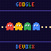
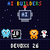
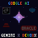

# 🍌 nano-banana-devoxx-pixels

64×64 animated pixel-art visuals for the **Google Cloud Raffle at Devoxx Belgium 2026** (Antwerp) — made for the LED matrix displays at the Google Cloud booth.

| | |
|---|---|
|  | **#4 · Google chomps Devoxx** — a Google-colored "G" chases four ghosts across the matrix. |
|  | **#7 · AI Builders** — partner mascots feed an AI robot, in the spirit of this year's *From Developer to Builder* theme. |
|  | **#11 · Gemini powers the partners** — the Gemini star lights up the logos of fellow Devoxx partners (JetBrains, Docker, Red Hat, Oracle). |

## How they are made

Every frame is **procedurally drawn with Python + Pillow** (no image-generation model is called by this code). Sprites are hand-placed pixel grids, text uses a tiny built-in 3×5 pixel font, animation = list of frames saved as a looping GIF.

```bash
pip install -r requirements.txt
python chomp.py             # -> output/4_google_chomps_devoxx.gif
python mascots_ai.py        # -> output/7_mascots_ai.gif
python gemini_partners.py   # -> output/11_gemini_powers_partners.gif
```

* `common.py` – shared palette, 3×5 font and helpers
* `chomp.py`, `mascots_ai.py`, `gemini_partners.py` – one script per visual (edit colors/text/sprites and re-run)

All outputs are exactly 64×64 so they map 1:1 to the LED matrix.

## Notes

* Mascots and logos are **simplified, hand-drawn pixel interpretations** made as a friendly nod to the partners; they are not official assets. All trademarks belong to their respective owners.
* The Gemini star colors are an approximation of the real gradient.

See `prompts.md` for untested Nano Banana prompt ideas for the same concepts.
